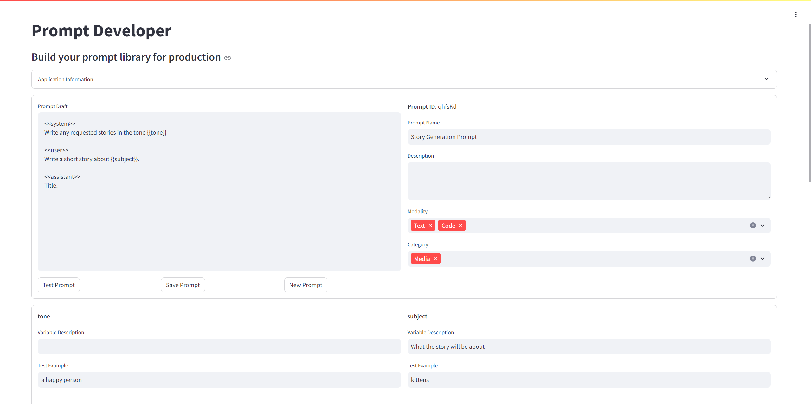

# Prompt Developer
This is a streamlit tool for developing prompts for your applications.

## How to use
You can deploy the streamlit app (python file) and assuimg you have access to Amazon Bedrock, you can use the app to develop your prompts
